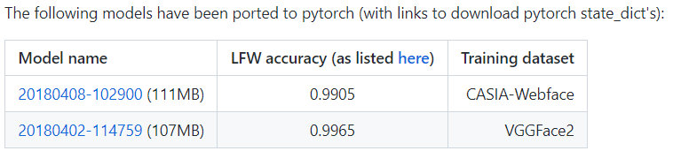

## facenet API

## 一、接口说明

该接口为人脸特征提取接口，使用了inception_resnet_v1作为特征提取模型

代码由官方代码重构而得，
官方代码见：https://github.com/timesler/facenet-pytorch.git

提供了两种权重，在LFW数据集上效果如下：



## 二、环境说明

环境配置: 见requirements.txt

## 三、接口参数说明

##### **facenet.src.cal_embedding**.cal_face_embedding

人脸特征提取类

类构建参数：

1. model_weights: str, 模型权重路径，

   44服务器，路径“/home/yuyingchao/work_space/projects/huangniu_detect/Demo_code/facenet/src/weights”中提供了训练集为VGGFace2的模型权重：20180402-114759-vggface2.pt，

   训练集为CASIA-Webface的模型权重可在官方代码：https://github.com/timesler/facenet-pytorch.git
   中下载，下载完成后将其放在weights文件夹下，初始化时修改model_weights参数即可。

2. device: torch.device object, 推理时的device

###### **facenet.src.cal_embedding.cal_face_embedding**.get_img_faces_embedding

单张图片中的所有人脸特征提取方法

1. 输入参数：<br>
   img: ndarray, shape：(H, W, 3), 通道顺序：BGR<br>
   boxes: ndarray, (N, 4), 左上角右下角xy坐标
2. 输出结果：<br>
   faces_emb: tensor, (N, 512), N个人脸的512维特征<br>

## 四、接口使用样例

**you can use it as submodule**

在自己的项目目录下，git submodule add  https://github.com/ahaqu01/facenet.git

便会在项目目录下下载到facenet相关代码

下载完成后，便可在自己项目中使用facenet API，**使用样例**如下：

```python
import torch
from facenet.src.cal_embedding import cal_face_embedding

c_f_e = cal_face_embedding(
    model_weights="./facenet/src/weights/20180402-114759-vggface2.pt"
    device='cuda:0' if torch.cuda.is_available() else 'cpu')
# inputs
# img: BGR, (H, W, 3), numpy.ndarray
# boxes: numpy.ndarray, (N, 4), xyxy

# outputs
# faces_emb, touch, (N, 512), if device is cuda, then faces_emb data is on gpu
faces_emb = c_f_e.get_img_faces_embedding(img, boxes)
```
